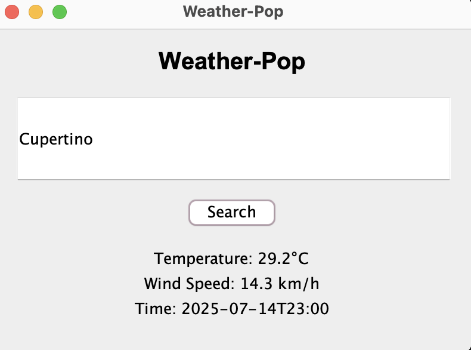

# WeatherPop – Java

A little weather app I built (and rebuilt) to learn more about Java, APIs, and GUIs

> This started as a class assignment with some group members, but honestly, I wanted to really understand how everything works — so I decided to create my own version from scratch.
>
> It’s a super simple Java desktop app that lets you type in a city and see the current weather. It was my first time using a weather API, and also one of my first GUI apps using Swing.

## What This Project Does

WeatherPop is a lightweight Java desktop app that:

- Lets users search for a city
- Fetches current weather data via Open-Meteo
- Displays temperature, wind speed, and time.

## System Diagram

## Installation & Usage (End-Users)

1. Make sure you have Maven
2. Clone the project:
   git clone https://github.com/mushroommmei/weather-pop.git
   cd weather-pop
3. Run the application:
   mvn compile
   mvn exec:java

The app window will launch. Enter a city and click to see weather data.

## Installation & Setup (Contributors)

Want to build or improve this app?

git clone https://github.com/mushroommmei/weather-pop.git
cd weather-pop
mvn compile

You can open the project directly in IntelliJ IDEA or any Maven-compatible IDE.

## Contributor Expectations

I’m open to collaboration.If you want to contribute:

1. Open an issue with your suggestion or feature
2. Fork the repo and work on a new branch
3. Submit a pull request
4. Follow Java best practices (clean code, comments, etc.)

I’m still growing as a developer, so let’s help each other learn.

## Known Issues

- Weather data occasionally fails for cities with special characters (such as São Paulo or 北京)
- No loading spinner when waiting for API response (users might not realize it’s fetching)
- UI is basic and only works on desktop

## Why I Made This Public

I’m still a student, but I want to:

* Learn by doing
* Share my progress
* Show my honest growth as a beginner dev
* Maybe connect with others who’ve built stuff like this too!

## License

MIT License — free to use, modify, or build on.
